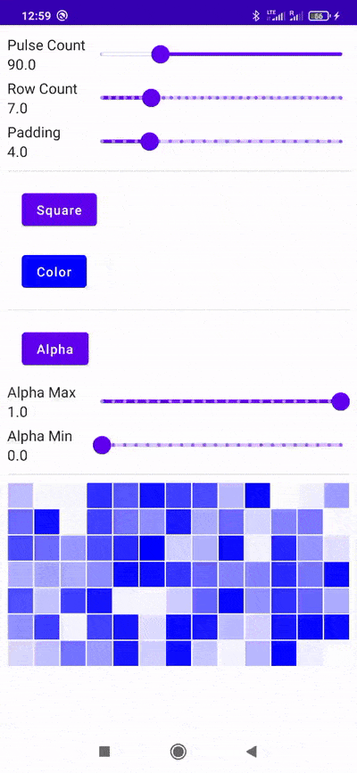

## Pulsar

A jetpack compose implementation of the contribution chart popularised by github.

Essentially this is a chart that will show values by drawing shapes. Values are represented by 
changing the alpha or size (or both) of said shapes.

### Current State

This lib is currently under development and any api could be changed without notice